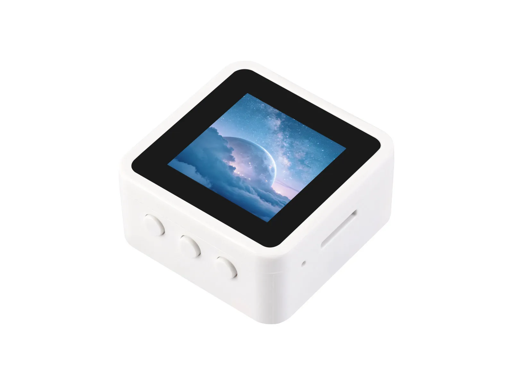

# Waveshare ESP32-C6-Touch-LCD-1.54

[English](README.md)

ESP32-C6-Touch-LCD-1.54 是一款基于 ESP32-C6 的紧凑型开发板，搭载最高 160 MHz 的单核 32 位 RISC-V 处理器和 16 MB Flash，支持 2.4 GHz Wi-Fi 6、蓝牙 5 (LE)，以及用于 Zigbee 和 Thread 的 IEEE 802.15.4 无线通信。板载 1.54 英寸 240 × 240 电容触摸 LCD、QMI8658 六轴 IMU、音频输出、TF 卡槽、USB Type-C、三个用户按键和电池支持，适用于 LVGL 图形界面、便携设备、智能家居控制及其他物联网应用。

- [购买链接](https://www.waveshare.net/shop/ESP32-C6-Touch-LCD-1.54.htm)
- [产品文档](https://docs.waveshare.net/ESP32-C6-Touch-LCD-1.54)



## 仓库结构

本仓库提供 ESP32-C6-Touch-LCD-1.54 的示例程序、预编译固件和硬件设计文件。

```text
.
├── examples/        # ESP-IDF 和 Arduino 示例程序
├── Firmware/        # 预编译固件
├── Hardware/        # 硬件原理图
└── assets/          # 文档使用的图片
```

## 快速开始

[`Firmware/`](Firmware) 目录中提供了预编译固件。开发环境搭建、固件烧录、引脚定义和配置说明请参考[产品文档](https://docs.waveshare.net/ESP32-C6-Touch-LCD-1.54)。

## 参与贡献

欢迎参与贡献，可按以下步骤提交改进：

1. Fork 本仓库。
2. 为新功能或问题修复创建分支。
3. 提交修改，并填写清晰的提交说明。
4. 创建 Pull Request，等待审核。

## 问题与支持

请在仓库中提交包含详细信息的 [Issue](https://github.com/waveshareteam/ESP32-C6-Touch-LCD-1.54/issues)，或携带订单号联系微雪团队获取技术支持。

## 许可证

本项目采用 Apache License 2.0 许可证，详情请参阅 [LICENSE](LICENSE) 文件。

---

感谢您使用微雪电子产品！
